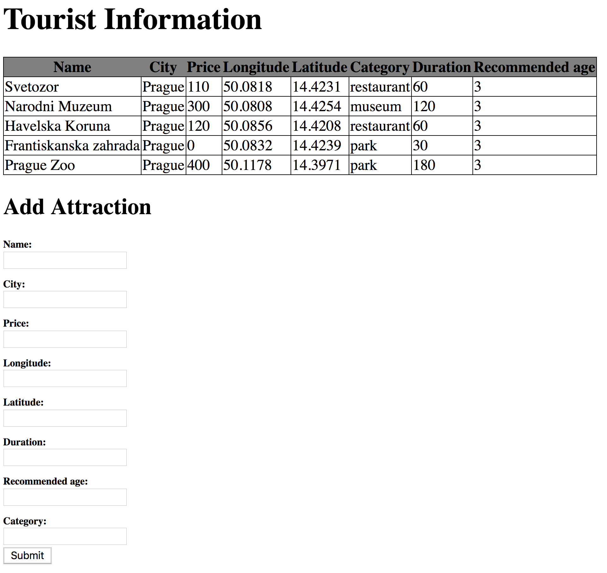

# Prague Vulpes Orientation Exam

## Tourist Information

Build a web application for tourists to find the best attractions.

## Endpoints

Create the following endpoints:

### GET `/`

The main page is rendered:


-  all known attractions are listed in a table
-  a form is displayed to add a new attraction

### POST `/add`

A new attraction is saved:
-  validate the user input, every field is required
    -  (optional) display an error message if the validation is failed
-  save the new attraction to the database (if all fields are provided and befit the database constraints)
-  redirect to the main page

### GET `/edit/{id}`

The main page is rendered with the form prefilled with the attraction details:
-  all known attractions are listed in a table
-  a form is displayed to edit the attraction specified by the `id`
 
### GET `/budget`

The list containing the cheapest attractions of the following categories are returned in **JSON** format:
- restaurant
- park
- museum

example answer:
```json
{
  "attractions": [
    {
      "id": 1,
      "attr_name": "Svetozor",
      "city": "Prague",
      "category": "restaurant",
      "price": 110,
      "longitude": 50.0818,
      "latitude": 14.4231,
      "recommended_age": 3,
      "duration": 60
    },
    {
      "id": 4,
      "attr_name": "Frantiskanska zahrada",
      "city": "Prague",
      "category": "park",
      "price": 0,
      "longitude": 50.0832,
      "latitude": 14.4239,
      "recommended_age": 3,
      "duration": 30
    },
    {
      "id": 2,
      "attr_name": "Narodni Muzeum",
      "city": "Prague",
      "category": "museum",
      "price": 300,
      "longitude": 50.0808,
      "latitude": 14.4254,
      "recommended_age": 3,
      "duration": 120
    }
  ]
}
```
 
## 2) Question time
 -  Write an SQL query to get all `Renault` cars which are more expensive than 8000
 -  Write an SQL query to decrease all `Volkswagen` car's price by 100 units
 

## optional) Endpoint Testing
-  Create a test case for each endpoint to test if the returned status code is `200 OK`
-  Create a test case for a non-existing endpoint to test if the returned status code is `404 Not Found`
-  Create a test case for the `/budget` endpoint to test if the correct attractions are returned
