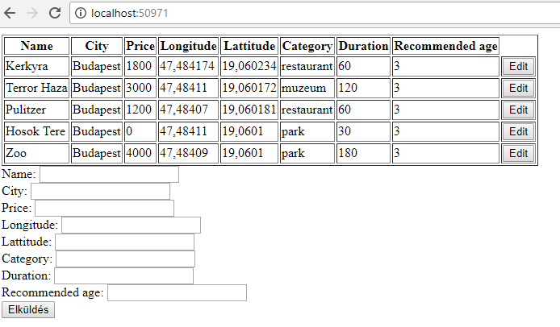

# Alopex Orientation Exam

## Tourist Inform

Build a web application that people can use to find the best attractions

## Endpoints
 -  you should create these endpoints:

### GET `/`
This endpoint should render the main page:


 -  list all known attractions in a table
 -  if submitted and response is ok, the frontend should append the new attraction to the table
 -  clicking on the edit button should fill the form with the row's data

### POST `/add`
This endpoint should
 -  check all field's content, every field is required except id  
 -  if id is NOT provided, add a new attraction to the database(if all fields provided and befit to the database constraints)
 -  if id is provided, update the existing record
 -  the body of the request should be like:
 

```json
{
    "id": 1,
    "name": "Kerkyra",
    "city": "Budapest",
    "price": 1800,
    "lattitude": 47.484174,
    "longitude": 19.060234,
    "category": "restaurant",
    "duration": 10.0,
    "recommendedAge": 13
}
```
 -  and the response should be like:

```json
{
  "status": "ok",
  "id": 1
}
```
  
### GET `/budge`
This endpoint should:
 -  returns a list of the cheepest row out of the following categories (1 item each):
    - restaurant
    - park
    - museum

example answer:
```json
{
     [
        {
            "id": 2,
            "name": "House of Terror",
            "city": "Budapest",
            "price": 3000,
            "lattitude": 47.484110,
            "longitude": 19.060172,
            "category": "museum",
            "duration": 120,
            "recommendedAge": 3
        },
        {
            "id": 3,
            "name": "Pulitzer",
            "city": "Budapest",
            "price": 1200,
            "lattitude": 47.484162,
            "longitude": 19.060225,
            "category": "restaurant",
            "duration": 10.0,
            "recommendedAge": 3
        },
        {
            "id": 4,
            "name": "Heroes' Square",
            "city": "Budapest",
            "price": 0,
            "Lattitude": 19.060100,
            "logitude": 47.484110,
            "category": "park",
            "duration": 30,
            "reccomendedAge": 3
        }
    ]
}
```

## 2) Question time
 -  Write an SQL query to get all `Renault` which more expensive than 8000
 -  Write an SQL query to modify all `Volkswagen`'s price 100 unit lower
 

## optional) Endpoint TESTing
 -  You should create a test case that the endpoint returns with a `200` status code for each endpoint
 -  Create a test case for a not existing endpoint, you should expect `404` status code
 -  You should create a test case for the `/filter` endpoint with `restaurant` category, it should have `?` number in the `count` and the first item's name should be `Kerkyra`  
